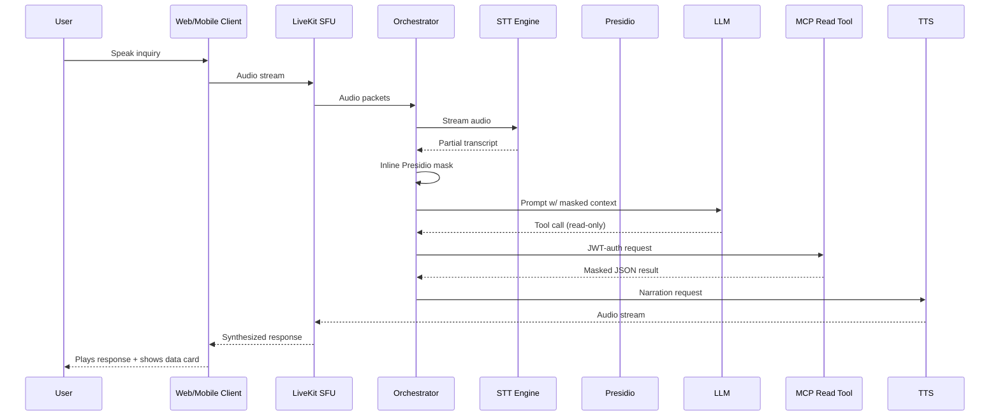
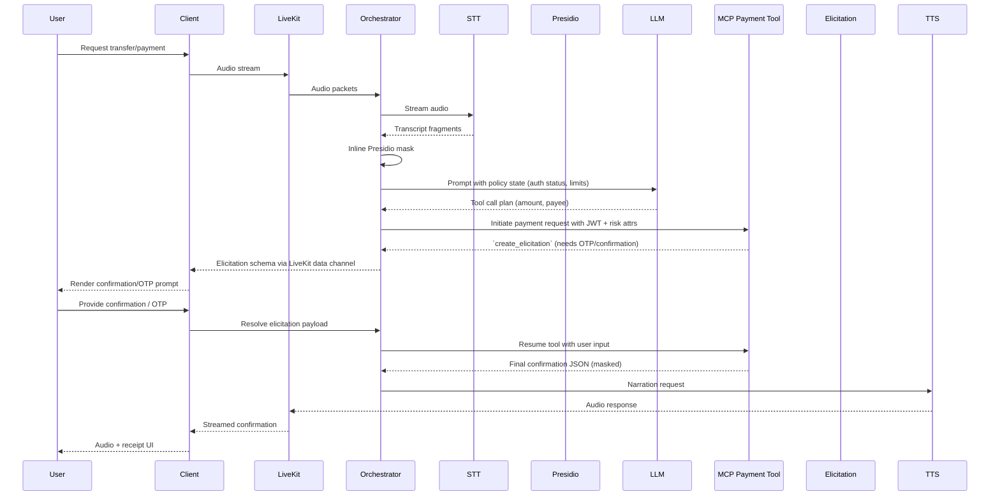
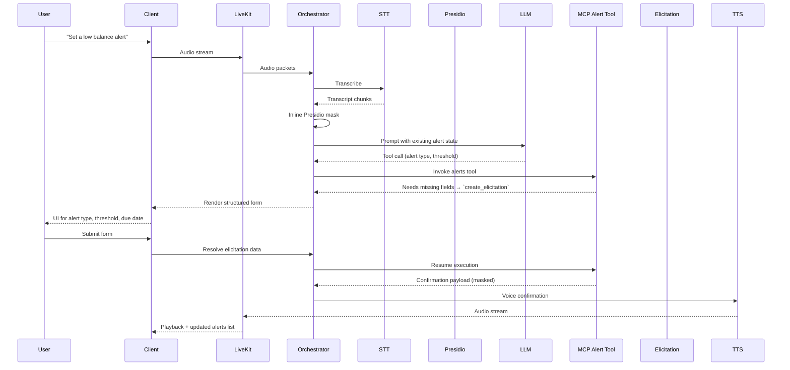

# Real-Time Banking Voice Agent Journeys

This document outlines the end-to-end architecture for the LiveKit-powered banking assistant. It focuses on how services collaborate across three conversation types: read-only inquiries, transactional payments, and alert configuration.

## System Overview

| Component | Responsibility |
| --- | --- |
| LiveKit (Cloud/SFU) | Low-latency bi-directional media + data transport, session state, interruption handling via VAD. |
| STT Provider (AssemblyAI / Deepgram) | Streams partial transcripts back to the orchestrator. |
| Littellm Gateway + Presidio Guardrail (inline) | Combined lightweight gateway inside the orchestrator process that masks PII before forwarding prompts to downstream LLMs. |
| Secure AI Orchestrator (Python) | Manages conversation memory, policy checks, inline Presidio masking, Littellm routing, MCP tool calls, Redis session cache, audit writes. |
| LLM (OpenAI/Azure/Groq via LiveKit Agents) | Tool-constrained reasoning and response generation, reached through the Littellm gateway. |
| MCP FastAPI Server | Exposes hardened, JWT-authenticated banking tools; emits elicitation pauses when user validation is required. |
| Datastores (Redis, Postgres, Object Storage) | Redis holds active session/context, Postgres stores masked transcripts, tool logs, audit ledger; optional encrypted media storage. |
| TTS Engine (Cartesia / ElevenLabs) | Converts final JSON response to real-time speech streamed via LiveKit. |
| Client Apps (Next.js web, React Native mobile) | Render live transcript, elicitation prompts, confirmations; capture user input to resolve elicitation. |

> **Hackathon Simplification**  
> To stay lightweight, Presidio and Littellm live inside the orchestrator process. This avoids standing up extra microservices while still enforcing masking and giving us a single integration point for LLM providers.

---

## Journey 1: Read-Only (Balances, Transactions, Loans)

**Flow Notes**

- Conversation state and masked transcripts persist in Redis/Postgres for audit.
- Results are cached per customer/session where allowable (e.g., balances).
- Observability: trace spans (`stt_chunk`, `presidio_mask`, `llm_request`, `tool_response`, `tts_stream`) captured via OpenTelemetry.

---

## Journey 2: Transactional Payments & Transfers

**Controls & Guardrails**

- MFA enforced by policy: OTP via elicitation, device biometrics on mobile, optional supervisor approval.
- Tool execution sandboxed; only pre-registered endpoints callable. Structured schema validation ensures no prompt-injected parameters.
- All sensitive payloads masked before logging; raw data scoped to MCP tool and upstream banking API only.

**Observability & Recovery**

- Trace IDs link elicitation lifecycle (`elicitation_created`, `elicitation_resolved`, `tool_resume`).
- If orchestrator restarts, Redis-backed tool suspension state resumes; stale elicitations expire with user notification.
- Metrics: payment success ratio, average elicitation roundtrips, fraud-rule hits.

---

## Journey 3: Write Operations (Alerts, Reminders)

**Key Considerations**

- Ensure idempotency: repeated alert setup merges or updates existing entries.
- Present updated alert list in UI immediately after tool completion.
- Masked descriptions and thresholds logged for compliance; raw thresholds stored securely within core banking system.

---

## Cross-Cutting Technical Concerns

- **Session State & Recovery**: Redis stores conversation stage, last tool call, outstanding elicitations. On crash, orchestrator restores session and prompts user gracefully.
- **Authentication & Authorization**: LiveKit token bootstraps session; orchestrator issues short-lived JWT with scopes (read, transact, configure) per user role. MCP tools enforce scope + session freshness.
- **Compliance & Privacy**: Presidio runs inline inside the orchestrator/Littellm gateway before LLM calls; only masked transcripts/JSON persist. Raw audio retained (if required) in encrypted object storage with strict retention policies.
- **Observability**: OpenTelemetry spans across LiveKit hooks, orchestrator, MCP tools. Metrics surfaced to Prometheus/Grafana; structured logs sent to centralized store (Loki/ELK) with PII removed.
- **Error Handling**: Graceful degradation—if STT fails, fallback to chat input; if TTS unavailable, send text response; if tool errors, communicate failure reason and escalate to human agent.
- **Mobile & Web Parity**: Shared JSON schema defines elicitation fields, validations, copy. React Native implements identical renderer; applies biometric re-auth before showing sensitive prompts.
- **Security Hardening**: Output validation for LLM tool calls, prompt injection detection, rate limiting per user/session, certificate pinning for API calls on mobile.

---

## Near-Term Backlog

1. **Finalize MCP Tool Schemas** for balance lookup, transaction list, loan summary, payments, alert management, including elicitation payload definitions.
-2. **Prototype Inline Presidio Streaming Masking** with representative transcripts to tune entity detection latency vs. accuracy while validating CPU/memory footprint against hackathon constraints.
3. **Extend Next.js UI** to render elicitation prompts, masked transcript timeline, and audit sidebar.
4. **Bootstrap React Native Client** with LiveKit RN SDK and shared elicitation renderer.
5. **Implement Observability Pipeline** (OpenTelemetry exporters, dashboards, alert rules).
6. **Draft Compliance Artifacts**: data flow diagrams, retention policy, threat model highlighting Presidio guardrail and MCP HITL controls.

This blueprint provides the foundation for detailed sequence diagrams, backlog grooming, and compliance documentation required before moving to production hardening.

